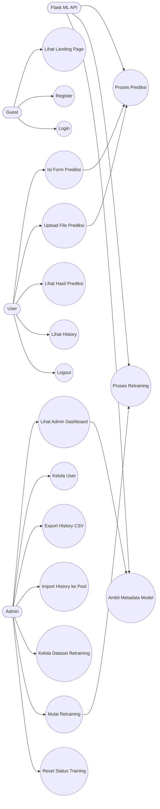
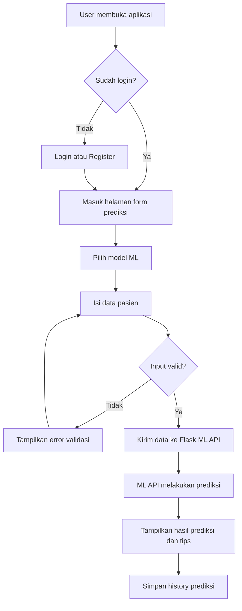
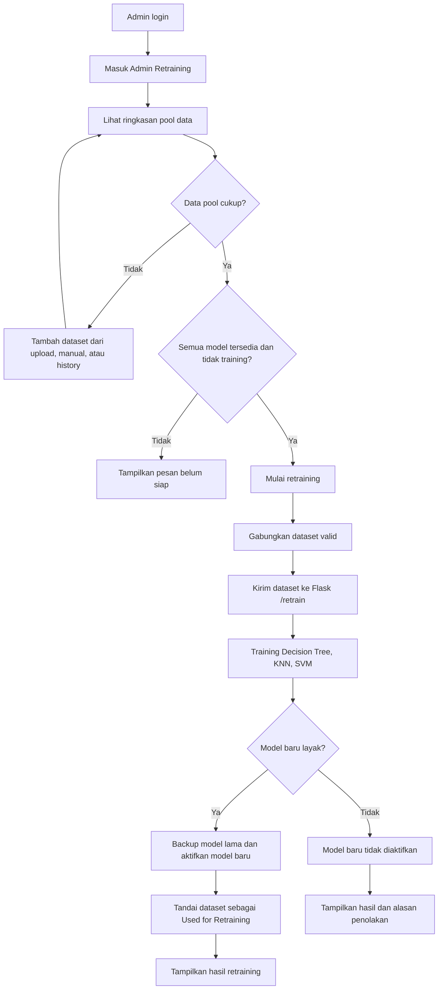
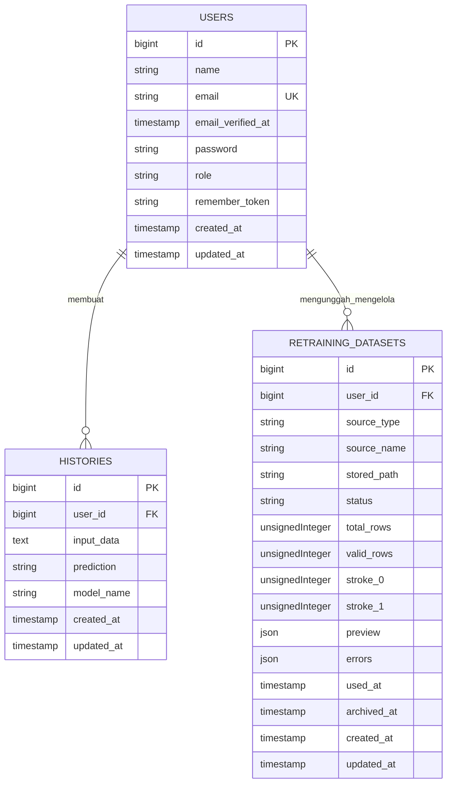

# Dokumentasi Analisis dan Perancangan Web StrokeRisk

Tanggal dokumen: 1 Juni 2026

## 1. Ringkasan Sistem

StrokeRisk adalah aplikasi web berbasis Laravel dan Flask ML API untuk membantu pengguna melakukan prediksi risiko stroke berdasarkan data demografis, riwayat kesehatan, dan gaya hidup. Sistem menyediakan fitur prediksi manual, prediksi batch melalui upload file, penyimpanan history prediksi, serta panel admin untuk mengelola user, dataset retraining, dan proses retraining model machine learning.

Sistem menggunakan tiga model machine learning:

- Decision Tree
- KNN
- SVM

Laravel berperan sebagai web application, autentikasi, manajemen data, UI, dan penghubung ke ML API. Flask berperan sebagai service prediksi dan retraining model.

## 2. Tujuan Sistem

Tujuan utama sistem adalah:

1. Membantu user melakukan prediksi awal risiko stroke secara cepat dan terstruktur.
2. Menyimpan history prediksi agar user dapat melihat kembali hasil input sebelumnya.
3. Menyediakan fitur batch prediction untuk memproses banyak data pasien sekaligus.
4. Memungkinkan admin mengelola user dan dataset retraining.
5. Memungkinkan sistem memperbarui model ML melalui proses retraining berbasis dataset valid.
6. Menjaga proses retraining tetap terkendali dengan validasi minimum data dan pembatasan akses admin.

## 3. Aktor Sistem

| Aktor | Deskripsi | Hak Akses Utama |
| --- | --- | --- |
| Guest | Pengunjung yang belum login | Melihat landing page, login, register |
| User | Pengguna terdaftar | Mengisi form prediksi, upload file prediksi, melihat history, logout |
| Admin | User dengan role admin | Semua fitur user, dashboard admin, kelola user, kelola dataset retraining, export history, mulai retraining |
| ML API | Service Flask untuk model ML | Menerima request prediksi, metadata model, dan retraining |

## 4. User Persona

### Persona 1: Pengguna Umum

| Aspek | Detail |
| --- | --- |
| Nama | Rina |
| Usia | 32 tahun |
| Peran | Pengguna umum |
| Latar belakang | Peduli kesehatan keluarga dan ingin melakukan pengecekan awal risiko stroke |
| Tujuan | Mengisi data pasien dan mendapatkan hasil prediksi yang mudah dipahami |
| Kebutuhan | Form sederhana, hasil prediksi jelas, tips kesehatan, history prediksi |
| Pain point | Tidak familiar dengan istilah medis dan takut salah input |
| Fitur yang digunakan | Register, login, form prediksi, hasil prediksi, history |

### Persona 2: Petugas Kesehatan atau Operator Data

| Aspek | Detail |
| --- | --- |
| Nama | Budi |
| Usia | 40 tahun |
| Peran | Operator data atau staf kesehatan |
| Latar belakang | Mengelola beberapa data pasien dalam bentuk spreadsheet |
| Tujuan | Melakukan prediksi untuk banyak data pasien secara batch |
| Kebutuhan | Upload CSV/XLSX, validasi file, ringkasan hasil, history otomatis |
| Pain point | Format file sering tidak seragam dan perlu feedback error yang jelas |
| Fitur yang digunakan | Login, upload prediksi, hasil upload, history |

### Persona 3: Administrator Sistem

| Aspek | Detail |
| --- | --- |
| Nama | Sabda |
| Usia | 22 tahun |
| Peran | Admin sistem |
| Latar belakang | Mengelola aplikasi, user, dataset, dan model ML |
| Tujuan | Memastikan sistem prediksi berjalan, data retraining valid, dan model dapat diperbarui |
| Kebutuhan | Dashboard ringkas, kontrol user, status model, validasi pool data, retraining aman |
| Pain point | Retraining tidak boleh dijalankan dengan data tidak cukup atau model belum siap |
| Fitur yang digunakan | Admin dashboard, kelola user, export history, import history ke pool, mulai retraining |

## 5. User Scenario

### Scenario 1: User melakukan prediksi risiko stroke manual

1. User membuka aplikasi StrokeRisk.
2. User login atau register jika belum memiliki akun.
3. User masuk ke halaman form prediksi.
4. User memilih model prediksi yang tersedia.
5. User mengisi data pasien seperti gender, age, hypertension, heart disease, status menikah, pekerjaan, tempat tinggal, kadar gula, BMI, dan status merokok.
6. Sistem memvalidasi input.
7. Laravel mengirim input ke Flask ML API endpoint `/predict`.
8. ML API mengembalikan hasil prediksi, probabilitas risiko tinggi jika tersedia, nama model, dan akurasi model.
9. Sistem menampilkan hasil prediksi: Risiko Tinggi atau Risiko Rendah.
10. Sistem menyimpan input dan hasil ke tabel `histories`.

### Scenario 2: User melakukan prediksi batch melalui upload file

1. User login ke aplikasi.
2. User membuka halaman upload.
3. User memilih model prediksi.
4. User mengupload file CSV, TXT, XLSX, atau XLS.
5. Sistem membaca file dan memvalidasi kolom wajib.
6. Sistem memproses maksimal 500 baris per upload prediksi.
7. Setiap baris valid dikirim ke ML API untuk diprediksi.
8. Sistem menampilkan ringkasan jumlah data sukses, error, risiko tinggi, dan risiko rendah.
9. Setiap prediksi valid disimpan ke tabel `histories`.

### Scenario 3: User melihat history prediksi

1. User login ke aplikasi.
2. User membuka halaman history.
3. Sistem mengambil data history berdasarkan `user_id` user yang sedang login.
4. User melihat daftar prediksi sebelumnya, model yang digunakan, waktu prediksi, dan detail input.
5. User dapat menggunakan history sebagai referensi evaluasi atau laporan.

### Scenario 4: Admin mengelola user

1. Admin login ke aplikasi.
2. Admin membuka halaman admin dashboard.
3. Admin masuk ke halaman Users.
4. Admin mencari user berdasarkan nama atau email.
5. Admin memfilter user berdasarkan role.
6. Admin dapat mengubah role user menjadi admin atau user.
7. Admin dapat menghapus user, kecuali akun dirinya sendiri.
8. Jika user dihapus, history dan dataset terkait tetap disimpan sebagai arsip sistem dengan `user_id` dibuat null.

### Scenario 5: Admin memasukkan history prediksi ke pool retraining

1. Admin membuka halaman Admin Retraining.
2. Sistem menampilkan ringkasan history prediksi valid.
3. Admin klik tombol import history ke pool retraining.
4. Sistem membaca semua history prediksi.
5. Sistem mengubah history menjadi format dataset retraining dengan kolom `stroke` dari hasil prediksi.
6. Sistem memvalidasi data.
7. Dataset valid disimpan ke tabel `retraining_datasets`.
8. File CSV valid disimpan di storage Laravel.
9. Pool retraining diperbarui.

### Scenario 6: Admin menjalankan retraining model

1. Admin membuka halaman Admin Retraining.
2. Sistem mengecek syarat minimum pool data:
   - Minimal 50 data valid.
   - Minimal 10 data stroke=0.
   - Minimal 10 data stroke=1.
   - Semua model tersedia.
   - Tidak ada retraining yang sedang berjalan.
3. Jika syarat terpenuhi, admin menekan tombol mulai retraining.
4. Laravel menggabungkan semua dataset valid menjadi satu file CSV.
5. Laravel mengirim request ke Flask ML API endpoint `/retrain`.
6. Flask menggabungkan dataset baru dengan dataset dasar jika tersedia.
7. Flask melatih model Decision Tree, KNN, dan SVM menggunakan pipeline preprocessing, SMOTENC, dan GridSearchCV.
8. Flask mengevaluasi model baru dibanding model lama.
9. Jika model layak, Flask membuat backup model lama dan mengaktifkan model baru.
10. Laravel menandai dataset valid sebagai `Used for Retraining`.
11. Admin melihat hasil retraining dan metrik model.

## 6. Use Case Diagram

Diagram berikut menggunakan Mermaid flowchart agar mudah ditempel ke dokumentasi atau AI lain.

## 7. User Flow Diagram

### Flow User Prediksi Manual

### Flow Admin Retraining

## 8. ERD

ERD inti sistem berfokus pada tabel `users`, `histories`, dan `retraining_datasets`. Tabel bawaan Laravel seperti `sessions`, `cache`, `jobs`, dan `password_reset_tokens` mendukung infrastruktur aplikasi, tetapi bukan entitas utama domain StrokeRisk.

### Penjelasan Relasi

| Relasi | Kardinalitas | Penjelasan |
| --- | --- | --- |
| users ke histories | 1 ke banyak | Satu user dapat memiliki banyak history prediksi. |
| users ke retraining_datasets | 1 ke banyak | Satu admin/user dapat membuat banyak dataset retraining. |
| histories.user_id | nullable FK | Jika user dihapus oleh admin, history dapat tetap disimpan sebagai arsip sistem. |
| retraining_datasets.user_id | nullable FK | Jika user dihapus, dataset retraining tetap dapat dipertahankan. |

## 9. Struktur Data Utama

### Tabel users

Tabel `users` menyimpan data akun dan role.

| Field | Fungsi |
| --- | --- |
| id | Primary key user |
| name | Nama user |
| email | Email unik untuk login |
| password | Password yang sudah di-hash |
| role | Pembeda hak akses, yaitu `user` atau `admin` |
| timestamps | Waktu pembuatan dan pembaruan data |

### Tabel histories

Tabel `histories` menyimpan riwayat hasil prediksi.

| Field | Fungsi |
| --- | --- |
| id | Primary key history |
| user_id | Relasi ke user pemilik history |
| input_data | JSON string berisi input pasien |
| prediction | Hasil prediksi, `0` untuk risiko rendah dan `1` untuk risiko tinggi |
| model_name | Nama model ML yang digunakan |
| timestamps | Waktu history dibuat dan diperbarui |

### Tabel retraining_datasets

Tabel `retraining_datasets` menyimpan metadata dataset yang dipakai untuk retraining.

| Field | Fungsi |
| --- | --- |
| id | Primary key dataset |
| user_id | Relasi ke user/admin yang membuat dataset |
| source_type | Sumber dataset, misalnya `upload`, `manual`, atau `history` |
| source_name | Nama sumber dataset |
| stored_path | Lokasi file CSV valid di storage Laravel |
| status | Status dataset: `Valid`, `Invalid`, `Used for Retraining`, `Archived` |
| total_rows | Jumlah baris total dari sumber |
| valid_rows | Jumlah baris valid |
| stroke_0 | Jumlah data label tidak stroke |
| stroke_1 | Jumlah data label stroke |
| preview | JSON preview data |
| errors | JSON error validasi |
| used_at | Waktu dataset dipakai retraining |
| archived_at | Waktu dataset diarsipkan |
| timestamps | Waktu data dibuat dan diperbarui |

## 10. Analisis Perancangan Sistem

### 10.1 Arsitektur Sistem

Sistem dirancang dengan arsitektur dua service:

1. Laravel Web App
   - Mengelola UI, route, autentikasi, authorization, validasi form, database, history, dataset retraining, dan admin panel.
   - Mengirim request HTTP ke Flask ML API untuk prediksi dan retraining.

2. Flask ML API
   - Menyediakan endpoint prediksi dan metadata model.
   - Menyediakan endpoint retraining.
   - Memuat model `.pkl`, feature columns `.json`, dan metrics `.json`.
   - Menyimpan model aktif dan backup model lama.

Pemisahan ini membuat UI dan domain web tidak tercampur langsung dengan proses training ML yang berat.

### 10.2 Modul Utama Laravel

| Modul | File utama | Tanggung jawab |
| --- | --- | --- |
| Authentication | `AuthController` | Login, register, logout |
| Prediction | `PredictionController` | Landing, form prediksi, upload prediksi, result, history |
| Admin | `AdminController` | Dashboard admin, user management, dataset pool, import history, export CSV |
| Retraining | `RetrainingController` | Upload/manual dataset, validasi dataset, combine pool, start retraining |
| Authorization | `EnsureUserIsAdmin` | Membatasi halaman admin hanya untuk role admin |

### 10.3 Modul Utama Flask ML API

| Endpoint | Method | Fungsi |
| --- | --- | --- |
| `/health` | GET | Mengecek status API dan model yang tersedia |
| `/models` | GET | Mengambil metadata seluruh model |
| `/metadata` | GET | Mengambil metadata model tertentu |
| `/predict` | POST | Memprediksi risiko stroke berdasarkan input |
| `/retrain` | POST | Melakukan retraining model dari dataset valid |

### 10.4 Perancangan Input Prediksi

Input prediksi menggunakan kolom:

| Kolom | Tipe | Keterangan |
| --- | --- | --- |
| gender | category | Male, Female, Other |
| age | numeric | Umur pasien |
| hypertension | binary | 0 atau 1 |
| heart_disease | binary | 0 atau 1 |
| ever_married | category | Yes atau No |
| work_type | category | Private, Self-employed, Govt_job, children, Never_worked |
| Residence_type | category | Urban atau Rural |
| avg_glucose_level | numeric | Rata-rata kadar gula |
| bmi | numeric | Body Mass Index |
| smoking_status | category | formerly smoked, never smoked, smokes, Unknown |

Untuk dataset retraining, ditambahkan kolom:

| Kolom | Tipe | Keterangan |
| --- | --- | --- |
| stroke | binary | Label target, 0 untuk tidak stroke dan 1 untuk stroke |

### 10.5 Validasi Sistem

Validasi dibuat berlapis:

1. Validasi Laravel
   - Memastikan form prediksi memiliki field wajib.
   - Membatasi tipe file upload.
   - Membatasi ukuran file.
   - Membatasi jumlah baris batch prediksi.
   - Memastikan dataset retraining memiliki kolom wajib.

2. Validasi Flask
   - Memastikan input JSON memiliki field sesuai feature columns.
   - Memastikan kategori sesuai mapping.
   - Memastikan nilai numerik dapat diproses.
   - Memastikan dataset retraining memiliki dua kelas target.

3. Validasi retraining admin
   - Minimal 50 data valid.
   - Minimal 10 data stroke=0.
   - Minimal 10 data stroke=1.
   - Semua model harus tersedia.
   - Proses retraining dikunci agar tidak berjalan bersamaan.

### 10.6 Perancangan UI/UX

UI dirancang dengan tema kesehatan profesional menggunakan warna hijau dan mint. Pertimbangannya:

- Hijau memberi kesan kesehatan, stabil, dan aman.
- Admin panel memakai warna hijau gelap agar terasa profesional dan fokus.
- Badge status dibuat jelas agar admin cepat memahami kondisi data.
- Form menggunakan label dan validasi agar user tidak bingung saat input.
- History dan dataset ditampilkan dalam tabel agar mudah discan.

Halaman utama yang dirancang:

| Halaman | Fungsi |
| --- | --- |
| Landing | Pengenalan sistem dan akses awal |
| Login/Register | Autentikasi user |
| Form Prediksi | Input data pasien secara manual |
| Upload Prediksi | Prediksi batch dari file |
| Result | Hasil prediksi, risiko, probabilitas, tips |
| History | Daftar prediksi user |
| Admin Dashboard | Ringkasan user, history, pool retraining, model |
| Admin Users | Kelola akun dan role |
| Admin Retraining | Kelola dataset, import history, dan retraining model |

### 10.7 Perancangan Keamanan

Beberapa mekanisme keamanan yang diterapkan:

1. Autentikasi berbasis Laravel Auth.
2. Route user dibatasi dengan middleware `auth`.
3. Route admin dibatasi dengan middleware `admin`.
4. Password user disimpan dalam bentuk hashed.
5. Admin tidak bisa menghapus akun dirinya sendiri.
6. Admin terakhir tidak boleh dihapus atau diturunkan role-nya.
7. Upload file dibatasi tipe dan ukuran.
8. Proses retraining memakai lock dengan TTL agar tidak terjadi proses ganda.

### 10.8 Perancangan Retraining Model

Retraining dirancang sebagai proses terkendali:

1. Dataset masuk dari upload, input manual, atau history prediksi.
2. Dataset divalidasi sebelum masuk pool.
3. Dataset valid disimpan dalam storage Laravel.
4. Jika pool memenuhi syarat, admin dapat menjalankan retraining.
5. Laravel menggabungkan dataset valid.
6. Flask melatih ulang model.
7. Model lama di-backup sebelum model baru diaktifkan.
8. Model baru hanya diaktifkan jika metriknya masih layak.

Kriteria kelayakan model baru:

- Recall stroke tidak turun lebih dari 5 persen dibanding model lama.
- F1-score stroke tidak turun terlalu besar.
- Accuracy tidak turun terlalu jauh.
- False negative tidak meningkat signifikan.

### 10.9 Perancangan Penyimpanan Model

ML API menggunakan artefak model:

| Jenis file | Fungsi |
| --- | --- |
| `.pkl` | File model machine learning |
| `feature_columns.json` | Daftar fitur yang dibutuhkan model |
| `metrics.json` | Metrik performa model |

Model aktif disimpan pada folder `ml-api/active_models`, sedangkan backup model lama disimpan pada folder `ml-api/backup_models`.

## 11. Analisis Kebutuhan Fungsional

| Kode | Kebutuhan |
| --- | --- |
| F01 | Guest dapat melihat landing page |
| F02 | Guest dapat register |
| F03 | Guest dapat login |
| F04 | User dapat mengisi form prediksi |
| F05 | User dapat memilih model prediksi |
| F06 | User dapat melihat hasil prediksi |
| F07 | User dapat melakukan upload file prediksi batch |
| F08 | User dapat melihat history prediksi miliknya |
| F09 | Admin dapat melihat dashboard admin |
| F10 | Admin dapat mencari dan memfilter user |
| F11 | Admin dapat mengubah role user |
| F12 | Admin dapat menghapus user dengan pengamanan dasar |
| F13 | Admin dapat export history ke CSV retraining |
| F14 | Admin dapat import history prediksi ke pool retraining |
| F15 | Admin dapat melihat dataset retraining |
| F16 | Admin dapat archive atau restore dataset |
| F17 | Admin dapat menjalankan retraining jika syarat terpenuhi |
| F18 | Admin dapat reset lock retraining jika proses sebelumnya bermasalah |

## 12. Analisis Kebutuhan Non-Fungsional

| Kategori | Kebutuhan |
| --- | --- |
| Usability | Tampilan mudah dipahami oleh user umum dan admin |
| Security | Akses admin harus dibatasi role admin |
| Reliability | Retraining tidak boleh berjalan bersamaan |
| Maintainability | Laravel dan Flask dipisah agar logic web dan ML mudah dirawat |
| Performance | Upload prediksi dibatasi maksimal 500 baris |
| Data Quality | Dataset retraining wajib valid sebelum masuk pool |
| Auditability | History prediksi dan metadata dataset disimpan |

## 13. Route Utama Sistem

| Route | Method | Akses | Fungsi |
| --- | --- | --- | --- |
| `/` | GET | Guest/User | Landing page |
| `/login` | GET/POST | Guest | Login |
| `/register` | GET/POST | Guest | Register |
| `/form` | GET | User | Form prediksi |
| `/predict` | POST | User | Submit prediksi manual |
| `/upload` | GET | User | Halaman upload prediksi |
| `/upload/predict` | POST | User | Submit prediksi batch |
| `/history` | GET | User | History prediksi user |
| `/logout` | POST | User | Logout |
| `/admin` | GET | Admin | Dashboard admin |
| `/admin/users` | GET | Admin | Kelola user |
| `/admin/users/{user}` | PATCH | Admin | Update role user |
| `/admin/users/{user}` | DELETE | Admin | Hapus user |
| `/admin/retraining` | GET | Admin | Kelola retraining |
| `/admin/retraining/history/import` | POST | Admin | Import history ke pool |
| `/admin/retraining/reset-lock` | POST | Admin | Reset lock training |
| `/admin/retraining/datasets/{dataset}/archive` | POST | Admin | Archive dataset |
| `/admin/retraining/datasets/{dataset}/restore` | POST | Admin | Restore dataset |
| `/admin/history/export` | GET | Admin | Export history CSV |
| `/retraining/start` | POST | Admin | Mulai retraining semua model |

## 14. Kesimpulan Perancangan

StrokeRisk dirancang sebagai aplikasi prediksi risiko stroke yang tidak hanya fokus pada hasil prediksi, tetapi juga pada pengelolaan data dan siklus pembaruan model. Pemisahan Laravel dan Flask membuat sistem lebih modular: Laravel menangani pengalaman pengguna dan data aplikasi, sedangkan Flask menangani machine learning.

Fitur admin memperkuat sistem karena admin dapat memantau jumlah user, history, status model, validitas dataset, dan kesiapan retraining. Dengan validasi dataset, minimum data, lock retraining, backup model, dan evaluasi metrik sebelum aktivasi, proses retraining dibuat lebih aman dan profesional.

## 15. Saran Pengembangan

Beberapa pengembangan lanjutan yang dapat dilakukan:

1. Menambahkan grafik tren prediksi per bulan pada dashboard admin.
2. Menambahkan audit log untuk aksi admin seperti update role, archive dataset, dan retraining.
3. Menambahkan export history user dalam format PDF.
4. Menambahkan notifikasi ketika retraining selesai.
5. Menambahkan role tambahan seperti operator.
6. Menambahkan halaman monitoring performa model dari waktu ke waktu.
7. Menambahkan validasi privasi data pasien dan disclaimer medis yang lebih formal.
8. Menambahkan queue/background job untuk retraining agar request web tidak menunggu proses panjang.

